# DEEPNET_vs_CONVNET_on_MNIST
Comparison of the performance of a simple fully connected network with a convnet on the MNIST dataset.


## Introduction
In the following we seek to apply a simple fully connected network and a convnet to the (standard) image classification problem as posed by the MNIST (Modified National Institute of Standards and Technology) dataset. This large dataset comprises of handwritten digits (where the training set amounts to 60.000 images and the test set to 10.000 images) and is used to train image processing systems. Schematically, the classification procedure is depicted in the subsequent picture (taken from [here](https://www.katacoda.com/basiafusinska/courses/tensorflow-getting-started/tensorflow-mnist-beginner)):

<p align="center">
  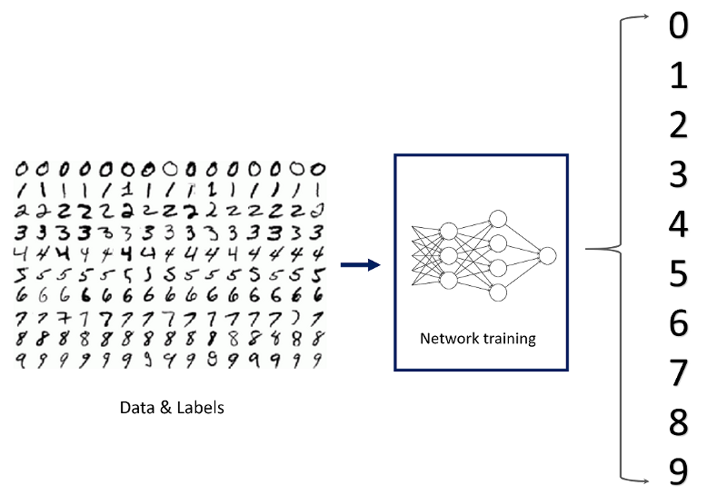
</p>

Generally speaking, the goal is to feed the networks with the training set, to learn to classify numbers from 0 to 9 and then to test the learnt classification scheme on the test set. The underlying insight to use deep neural networks for such a task (essentially a fitting-to-data problem) is that they are very powerful [function approximators](https://en.wikipedia.org/wiki/Universal_approximation_theorem).

In the following, we will first explain some details regarding convolutional neural networks and then compare the performance of both network architectures on the dataset. Afterwards, we discuss the impact of different optimizers and how overfitting can be easily dealt with. 

This readme file integrates some basic documentation, instructions and results. The analysis was done with python 3.6 with the keras library mounted. Instructions regarding files are attached at the end.

### Network architectures

In our image classification task we want to compare a [fully connected](https://www.deeplearningbook.org/contents/mlp.html) neural network to a [convolutional](https://www.deeplearningbook.org/contents/convnets.html) one. The basic difference in between a fully connected and a convolutional layer is that the former learns global patterns in their input feature space while the latter learns local patterns. Importantly, these patterns are translation invariant and once a specific pattern is learnt in a part of an image it can be recognized in another part. In this way, convnets need less training examples as they have a greater generalization power. In addition, convnets can learn more and more complex visual concepts while going deeper into the network. Hence, they can recognize statistical hierarchies of patterns.  

Notice that in the process of learning, the network learns the parameters of the filters of the convolution operation. A learnt filter is applied via striding to different parts of the image and can therefore recognize the same structure. This is also called parameter sharing and makes convnets efficient. The other important feature is dubbed sparse connectivity which means that each unit in a layer is only connected to a small region of its input volume. This takes the spatial structure of the data into account and exploits local spatial correlations. In this way, one can see how the accuracy of the convnet is superior to the basic densely connected neural network when applied to image data.

The architecture of the fully connected network reads as follows:
```
Layer (type)                 Output Shape              Param #   
=================================================================
dense_1 (Dense)              (None, 512)               401920    
_________________________________________________________________
dense_2 (Dense)              (None, 128)               65664     
_________________________________________________________________
dense_3 (Dense)              (None, 10)                1290      
=================================================================
Total params: 468,874
Trainable params: 468,874
Non-trainable params: 0
_________________________________________________________________
Train on 54000 samples, validate on 6000 samples
```

While the convnet takes the following form:
```
Layer (type)                 Output Shape              Param #   
=================================================================
conv2d_1 (Conv2D)            (None, 26, 26, 32)        320       
_________________________________________________________________
max_pooling2d_1 (MaxPooling2 (None, 13, 13, 32)        0         
_________________________________________________________________
conv2d_2 (Conv2D)            (None, 11, 11, 64)        18496     
_________________________________________________________________
max_pooling2d_2 (MaxPooling2 (None, 5, 5, 64)          0         
_________________________________________________________________
conv2d_3 (Conv2D)            (None, 3, 3, 64)          36928     
_________________________________________________________________
flatten_1 (Flatten)          (None, 576)               0         
_________________________________________________________________
dense_1 (Dense)              (None, 64)                36928     
_________________________________________________________________
dense_2 (Dense)              (None, 10)                650       
=================================================================
Total params: 93,322
Trainable params: 93,322
Non-trainable params: 0
_________________________________________________________________
Train on 54000 samples, validate on 6000 samples
```

In general, the output of every Conv2D and MaxPooling2D layer is a 3D tensor with the shape (height, width, channels). The width and height dimensions tend to shrink when going deeper in the network while the number of channels is increased. We observe that towards the end of the network the 3D outputs are flattened to 1D and this information is fed into a densely connected classsifier network.

Let us briefly delve into a more detailed description of the layers in the convnet: The convolutional layers extract patches from their input feature maps (a feature map is a 3D tensor) and transforms all the patches in the same way yielding an output feature map. The purpose of max pooling layers is to progressively downsample feature maps, similarly to so-called strided convolutions, by extracting windows from the input feature maps and returning the maximum value of each channel. In addition, successive convolutional layers are effectively looking at larger and larger windows and thus max pooling layers lead to an induction of spatial filter hierarchies. As a rule of thumb, it is best to produce dense maps of features and afterwards to look at the largest activation of the features over small patches.

## Observation and results

<p align="center">
  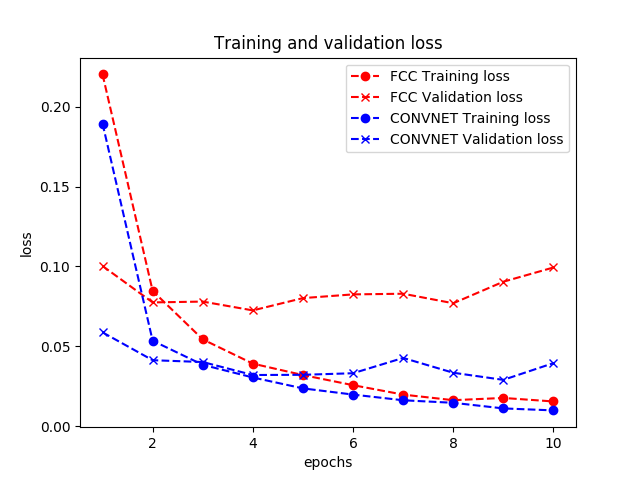
</p>


<p align="center">
  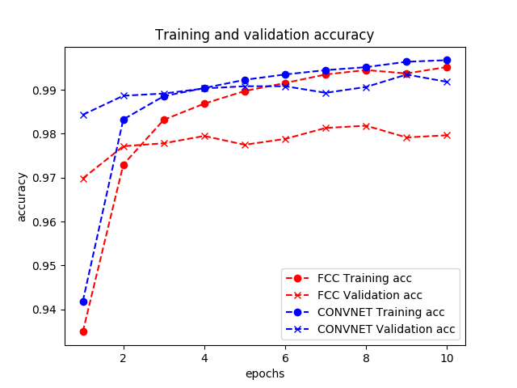
</p>

We observe that training losses and training accuracies improve with every epoch which agrees with the naive expectation that one has towards the merit of gradient descent optimization. However, for both networks (though less for the convnet) we observe that this does not apply to the validation losses and validation accuracies. The networks perform much better on the training data than on the validation data which is a clear sign of overfitting. They overoptimize on the training information and poorly generalize beyond that. Ways to tackle overfitting would be through getting more data, using early-stopping of training, reducing the network complexity through less layers and less units per layer, weight regularization and drop-out. We will discuss some of these methods for one of the networks below.
After 10 epochs, the test accuracies are given:

```
The test accuracy of the FCC model amounts to:  97.74 %
The test accuracy of the CONVNET model amounts to:  98.88 %
```
Despite the fact that both values are rather close to each other, if we do take the individual network capacities into account, it is clear that the convnet performs much better on the problem.

When using the attached code snippet, we may check the individual prediction of the convnet to the image from the test set with index 9999:
```
import matplotlib.pyplot as plt
image_index = 9999
plt.imshow(test_images[image_index].reshape(28, 28),cmap='Greys')
plt.show()
pred = modelCONVNET.predict(test_images[image_index].reshape(1, 28, 28, 1))
print("The convnet predicts the number to be: ",pred.argmax(),".")
```
The image is in fact a 6, 

<p align="center">
  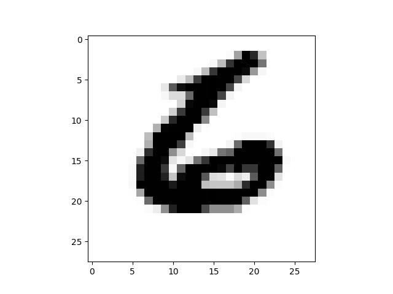
</p>

which is correctly predicted by the network: 
```
The convnet predicts the number to be:  6.
```

Regarding the size of the batches a batch size 64 seems to be a good compromise in terms of speed and accuracy.

### Improvements

#### Regularization: dropout, weight regularization and batch normalization

In general, it is best practice to commence with a model with fewer layers and fewer units and gradually increase the complexity of the network until one observes reducing returns regarding the validation loss. To tackle the problem of overfitting in the fully connected network, we can apply dropout layers in between the dense layers and mount L2 regularization onto the latter. Weight regularization forces the weights to smaller values rendering the distribution of weights more regular. Notice that since this penalty is only added at training time, the loss of the densely connected network will then be higher as compared to test time. On the other hand, dropout, when applied to a layer, randomly shuts down a number of units of that layer during training time. At test time, the output of that layer is scaled down by the dropout rate. In this way, insignificant happenstance patterns that the network would learn to identify are broken up.

The result of such an experiment is depicted in the following images:

<p align="center">
  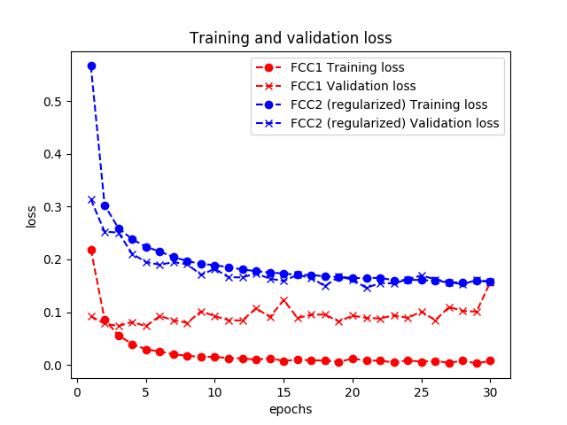
</p>


<p align="center">
  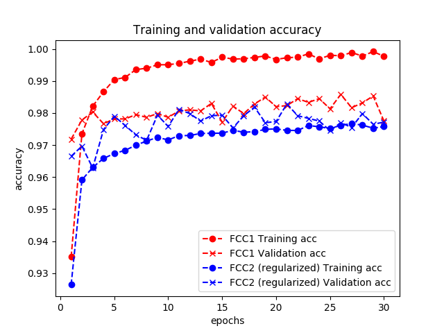
</p>

We observe that the model amended by L2 regularization and dropout is much less prone to overfitting as compared to the bare model.

Regarding the convnet, dropout should only apply to the fully connected region of the convnet. In the other regions, dropout is not applied, as it regularizes rather inefficiently convolutional layers. This is due to the fact that the convolution operation renders dropout ineffective (activations are typically highly correlated for convnets) and also because convolutional layers have fewer parameters anyways making them less prone to overfitting. Under the following [link](https://towardsdatascience.com/dont-use-dropout-in-convolutional-networks-81486c823c16) these matters are more thoroughly discussed. The insertion of a batch normalization layer between convolution and activation layers is recommendable since batch normalization does have a (slight) regularizing effect. Essentially, the normalization procedure substracts the mean from the data and center it around 0 and in addition, gives the data a unit standard deviation. This is based on the assumption that the available data obeys a Gaussian distribution and thus scales it to unit variance and centers it. Batch normalization adaptively normalizes the data during training and thus helps with gradient propagation (especially when very deep networks are used). An indication of this is depicted in the following plots (though it is clear that due to the shallowness of the used network the advantage of BN cannot come into full effect here):

<p align="center">
  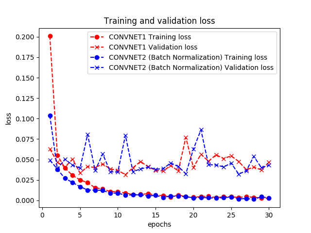
</p>

<p align="center">
  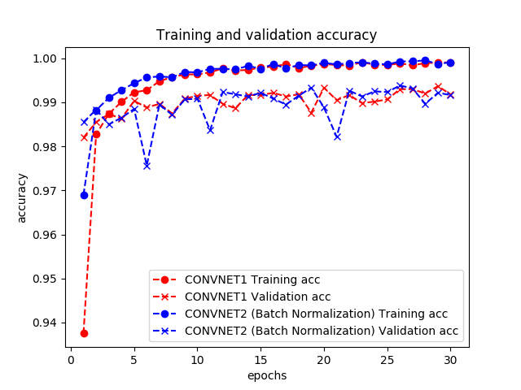
</p>


A thorough discussion (which also dives into the mathematical details) of regularization methods can be found e.g. [here](https://www.deeplearningbook.org/contents/regularization.html).

#### Different optimizers

In what follows, we will only focus on aspects of the convnet model. To start with, we want to compare the performances with regard to two different optimizers. For this we compare stochastic gradient descent (SGD) and the Adam optimizer. Other optimizers and their implementation in keras can be found [here](https://keras.io/optimizers/). A general discussion touching on differences in between various optimizers can be found [here](http://ruder.io/optimizing-gradient-descent/) and [here](https://blog.paperspace.com/intro-to-optimization-momentum-rmsprop-adam/) and a discussion specific to keras follows in this [post](https://www.dlology.com/blog/quick-notes-on-how-to-choose-optimizer-in-keras/). In a nutshell, the loss function and optimizer are the key for the configuration of the learning process. The loss function will be minimized during the training procedure and quantifies how successful we are coping in solving the task. Here, we do not wish to change the loss function. On the other hand, the optimizer tells us how the neural network will be updated given a specified loss function. For details regarding the optimizers, we refer to the above links. Adam is typically considered to be a stronger choice, which is indicated by our plots:

<p align="center">
  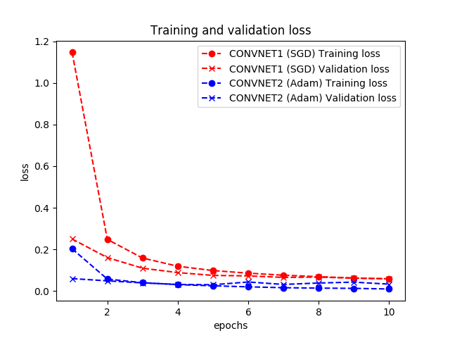
</p>

<p align="center">
  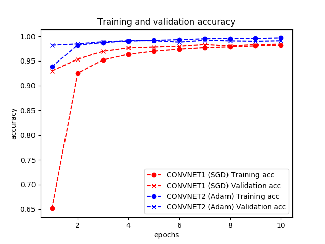
</p>

#### Comparison: averagepooling vs. maxpooling layers

The average pooling operation transforms each local input patch by taking the average value of each channel over the respective patch. The max pooling operation generally works better and our plots confirm this. Intuitively, this is because the maximal presence of different features is more informative than their average presence. This is indicated by the attached plots:

<p align="center">
  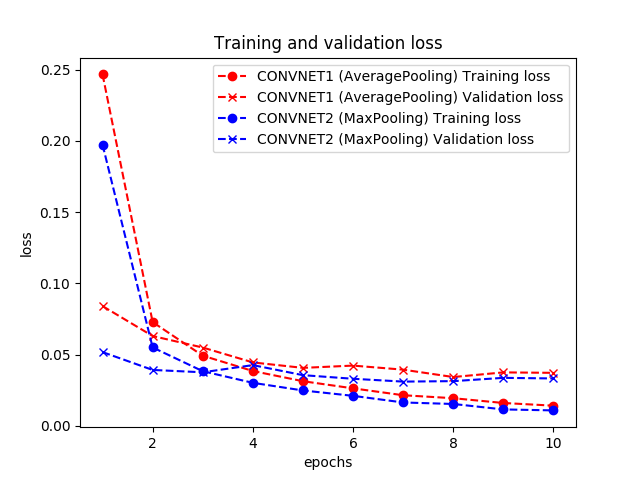
</p>

<p align="center">
  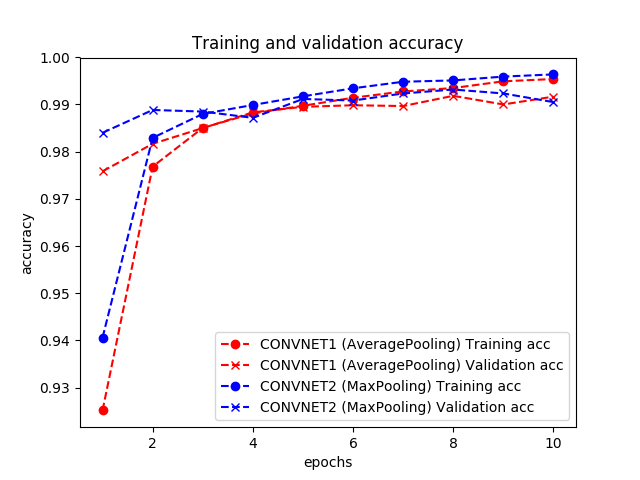
</p>


#### Comparison: valid padding vs. same padding

In case one desires to have an output feature map which has the same spatial dimensions as the input map, padding is applied. This amounts to adding a number of columns and rows on each side of the input map so that center convolution windows are fit around every input tile. Valid padding means no padding at all, same padding corresponds to the just described procedure. Padding is important if crucial information for the solution of the task is located at the border of the images and should be weighted in the same way as data in the centre of the images. In our case, we do not expect a tremendous improvement of results, since the numbers in the MNIST dataset are rather centered. This is confirmed by the following plots:

<p align="center">
  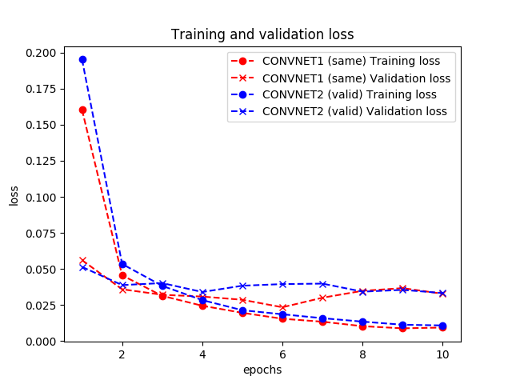
</p>

<p align="center">
  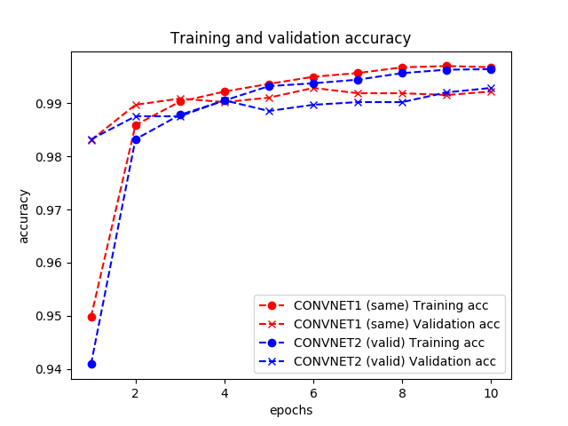
</p>

## Instructions
The relevant files for this analysis are attached: `FCC_vs_CONVNET.py`, `FCC_vs_FCC.py` and `CONVNET_vs_CONVNET.py`.
